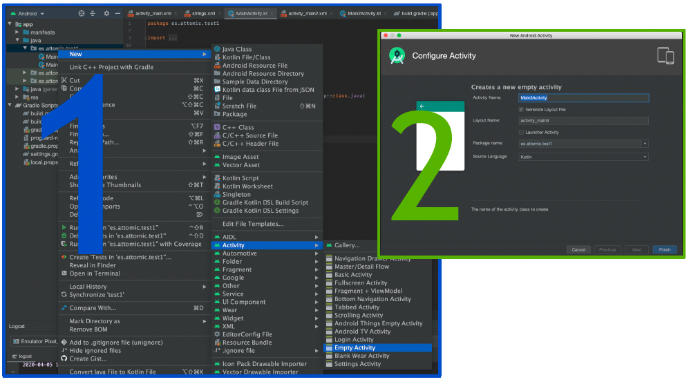

# Navegación I

* [Manifiest y Permisos](https://github.com/gitfrandu4/android-navigation#manifest-y-permisos)
* [Activitys & Intents](https://github.com/gitfrandu4/android-navigation#activitys--intents)
  * [Pasar datos](https://github.com/gitfrandu4/android-navigation#pasar-datos)
  * [Recibir datos](https://github.com/gitfrandu4/android-navigation#recibir-datos)

## Manifest y Permisos

El archivo de manifiesto proporciona información esencial sobre tu aplicación al sistema Android, información que el sistema debe tener para poder ejecutar el código de la app. 

Entre otras cosas, el archivo de manifiesto hace lo siguiente:

* Nombra el paquete que sirve como un **identificador único para la aplicación**.
* Describe los componentes de la aplicación, como las **actividades**, los **servicios**, los receptores de mensajes y los proveedores de contenido que la integran. 
* Declara los **permisos** que debe tener la aplicación para acceder a las partes protegidas de una API e interactuar con otras aplicaciones. También declara los permisos que otros deben tener para interactuar con los componentes de la aplicación. 

Toda la información del manifest: https://developer.android.com/guide/topics/manifest/manifest-intro?hl=es-419


## Activitys & Intents

Cuando creas una aplicación de Android, lo primero que debes hacer es crear una actividad . Las actividades son donde sucede toda la acción, porque son las pantallas que permiten al usuario interactuar con su aplicación.

Las actividades son uno de los componentes básicos de una aplicación de Android. Lo más importante que tienes que aprender sobre las actividades es:

1. El proceso para crear, iniciar y detener una actividad y cómo manejar la navegación entre actividades.
2. Las diversas etapas en el ciclo de vida de una actividad y cómo manejar cada etapa.
3. La forma de administrar los cambios de configuración y persistir los datos dentro de su actividad.

Los intents nos van a servir para lanzar la cámara, para recibir la imagen de la cámara, lanzar aplicaciones, etc. En nuestro caso lo vamos a usar para crear activitys y lanzarlas. Y también para pasar datos entre ellas. 

Tutorial para aprenderlo todo sobre las activities:
https://www.raywenderlich.com/165824/introduction-android-activities-kotlin


**Orden del ciclo de vida del activity**:

* **`onCreate()`**: cuando se crea la actividad por primera vez, aquí es donde se inicializan
los elementos de la interfaz de usuario (layouts) u objetos de datos. (solo cuando se crea)

* **`onStart()`**: justo antes de presentar al usuario una actividad, se llama a este método.
Siempre es seguido por onResume(). Por lo general, debe iniciar animaciones de IU, audio, etc.

* **`onResume()`**: cuando una actividad entra en primer plano, se llama a este método. (cuando volvemos del segundo plano)

* **`onPause()`**: se llama a este método antes de pasar al fondo. Aquí debe detener
cualquier imagen o audio asociado con la actividad, como las animaciones de la
interfaz de usuario..

* **`onStop()`**: Este método se llama inmediatamente después onPause(), cuando la
actividad ya no es visible para el usuario, y es un buen lugar para guardar los datos.

* **`onRestart()`**: se llama después de detener una actividad, pero justo antes de
comenzar de nuevo. Siempre es seguido por onStart().

* **`onDestroy()`**: esta es la llamada final que recibirá del sistema operativo antes de que
se destruya la actividad.


Las solicitudes para lanzar nuevas actividades, o recuperar las que no son visibles, se llaman [Intents](https://developer.android.com/reference/android/content/Intent.html) (intentos, solicitudes). 

Un Intent es el responsable de que le lance la primera actividad de una aplicación, y nuevos
intentos serán responsables de ir lanzando las nuevas pantallas que sean necesarias.

Cada Activity puede encontrarse en diferentes estados:

* Activa o en ejecución cuando ocupa el primer plano. La pantalla está visible y tiene el foco de la interacción del usuario.

* Pausada, cuando ha perdido el foco pero todavía es parcialmente visible. Típicamente ocurre cuando se abre un diálogo encima de la pantalla.

* Parada o detenida, cuando nada de ella es visible.

El sistema puede terminar una Activity en cualquier momento, bien invocando su método `finish()` o matando su proceso. Pero cuando escaseen los recursos y haya que terminar alguna Activity, acabará primero con aquellas que están paradas, luego con las pausadas y, ya en unasituación crítica, con aquellas activas.

* Un ejemplo de uso del `finish()` es cuando nuestra aplicación tiene una splash screen y queremos cerrar la ventana y continuar en la aplicación, sin que cuando le demos "atrás" vuelva a esa pantalla. 

En cada caso cuando una Activity termina debe guardar su estado para que cuando sea lanzada lo pueda recuperar. Cuando se realizan cambios de estado la plataforma invoca determinados métodos de la actividad para que esta pueda realizar las operaciones oportunas.

## Navegación

Uno de los primeros pasos para diseñar y desarrollar una aplicación de Android es ***determinar lo que los usuarios pueden ver y hacer con la aplicación***.

Una vez que sepa con qué tipos de datos están interactuando los usuarios en la aplicación, el
siguiente paso es diseñar las interacciones que les permitan a los usuarios navegar, entrar y salir de las diferentes partes del contenido dentro de la aplicación.


**Navegación con Activitys**

¿Cómo crear un Activity?



Cuando añadimos un nuevo activity se nos crea:

* Un layout (p. ej.: `activity_login.xml`)
* Modifica el manifest:

```xml
<activity
            android:name=".LoginActivity"
            android:exported="false">
            <meta-data
                android:name="android.app.lib_name"
                android:value="" />
        </activity>
```


**¿Cómo puedo abrir una activity desde otra activity?**

```kotlin
class MainActivity : AppCompatActivity() {
	override fun onCreate(savedInstanceState: Bundle?) {
		super.onCreate(savedInstanceState)
		setContentView(R.layout.activity_main)
		
		val intent = Intent(this, Main2Activity::class.java)
		startActivity(intent)
	}
}
```

Hay varias formas de añadir el botón de atrás de una activity, la más sencilla y más rápida es la siguiente:

1. Crea una activity
2. En el manifest, añade lo siguiente en la activity en la que quieres que tenga el botón de atrás.


```
android:parentActivityName=".NombreDeLaActivityPadre"
```


## Pasar datos

¿Cómo puedo enviar datos de una activity a otra?

```kotlin
class MainActivity : AppCompatActivity() {
	override fun onCreate(savedInstanceState: Bundle?) {
		super.onCreate(savedInstanceState)
		setContentView(R.layout.activity_main)

		val intent = Intent(this, Main2Activity::class.java)
		intent.putExtra("usuario", "Marin")
		startActivity(intent)
	}
}
```

## Recibir datos

¿Cómo puedo leer los datos que vienen de otra activity?

```kotlin
class Main2Activity : AppCompatActivity() {
	override fun onCreate(savedInstanceState: Bundle?) {
		super.onCreate(savedInstanceState)
		setContentView(R.layout.activity_main2)

		val bundle: Bundle? = intent.extras
		val myUser: String? = bundle?.getString("usuario")
		
		Log.v("miapp", "$myUser")
	}
}
```


